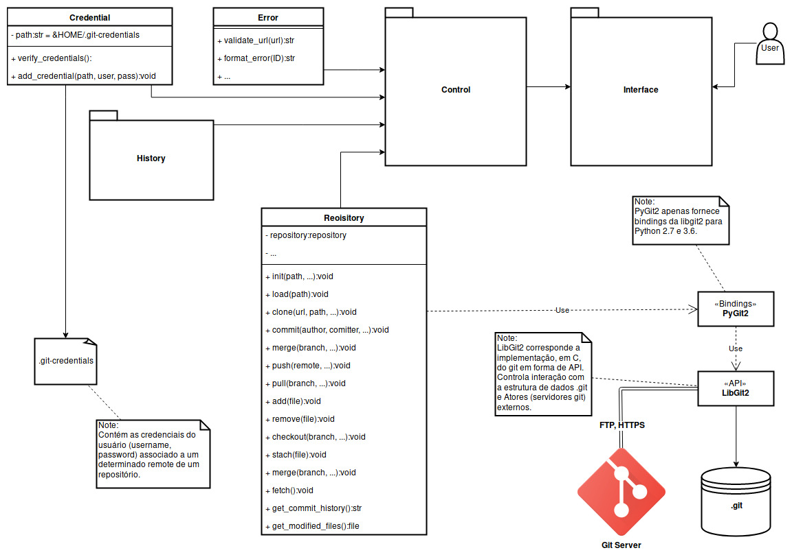

# vgit
A ferramenta vgit tem a finalidade de tornar o uso do git mais fácil e intuitivo.

# Dependências:
#### Gerenciadas pelo pip3
##### [PyGit2](https://www.pygit2.org/)
`
$ pip3 install pygit2
`
##### [pyinstaller](https://www.pyinstaller.org/)
`
$ pip3 install pyinstaller
`
##### [radon](https://radon.readthedocs.io/en/latest/)
`
$ pip3 install radon
`
##### [coverage](https://coverage.readthedocs.io/en/latest/)
`
$ pip3 install coverage
`

#### Externas:
##### [libgit2](https://libgit2.org/)
##### [GTK+](https://www.gtk.org/)

# Documentação
##### [Wiki](https://github.com/adrianograms/Trabalho-PES/wiki)

# Tecnologias
* Python 3.6 (PyGit2 apenas suporta Python 2.7 e 3.6)
* PyUnit (unittest)

# Estrutura do sistema

# Features:
| Features              | Backend | GUI |
|:----------------------|:-------:|:---:|
| git-clone             | ✔️      | ✔️  |
| git-pull              | ️❌      | ️❌  |
| git-push              | ✔️      | ❌  |
| git-init              | ✔️      | ✔️  |
| git-merge             | ❌️      | ❌  |
| log                   | ✔️      | ✔️  |
| git-remote            | ️❌      | ️❌  |
| git-merge             | ❌️      | ❌  |
| git-fetch             | ❌️      | ❌  |
| git-add/remove        | ✔️      | ✔️  |
| git-commit            | ✔️      | ✔️  |
| git-reverse           | ❌      | ❌  |
| git-stash             | ❌      | ❌  |
| Historico de commits  | ❌      | ❌  |
| Mudancas nos arquivos | ❌      | ❌  |
| Git credentials       | ❌      | ❌  |
| ShortCuts             | -       | ❌  |
##### Legenda:
❌ = não implementado
✔️ = implementado

# Ferramentas Utilizadas
##### Glade
Ferramenta para o desenvolvimento de GUIs para o GTK+ toolkit.

##### LGTM
Ferramenta de análise estática de  código, quanto a seguarança e erros communs a lógica da linguagem, de maneira automática.

##### radon
Ferramenta para computação de várias métricas de código, complexidade ciclomática e métricas halstead .

##### coverage
Ferramenta de análise de cobertura de execução de código e de testes.

# Plataformas Suportadas
vgit está disponível para os seguintes sistemas operacionais:
* Windows 10
* GNU/Linux

# Inspirado em:
* Magit
